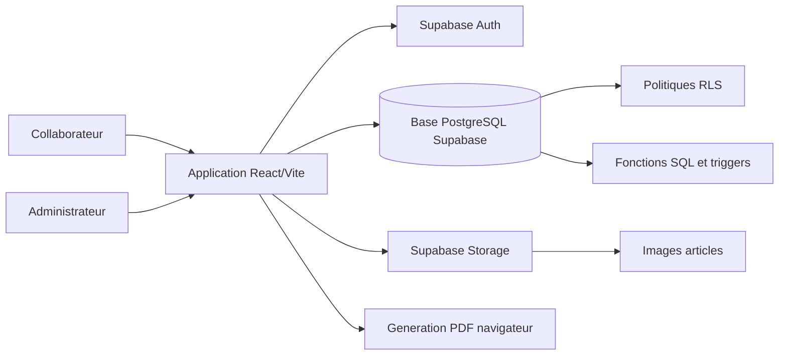
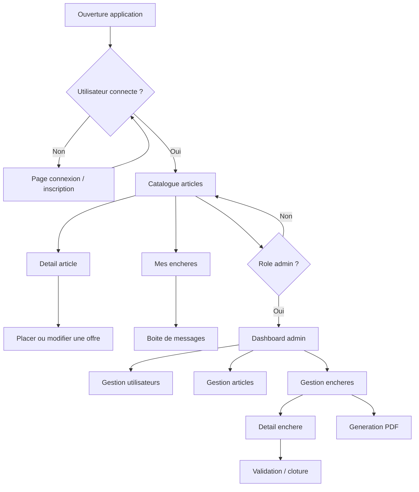
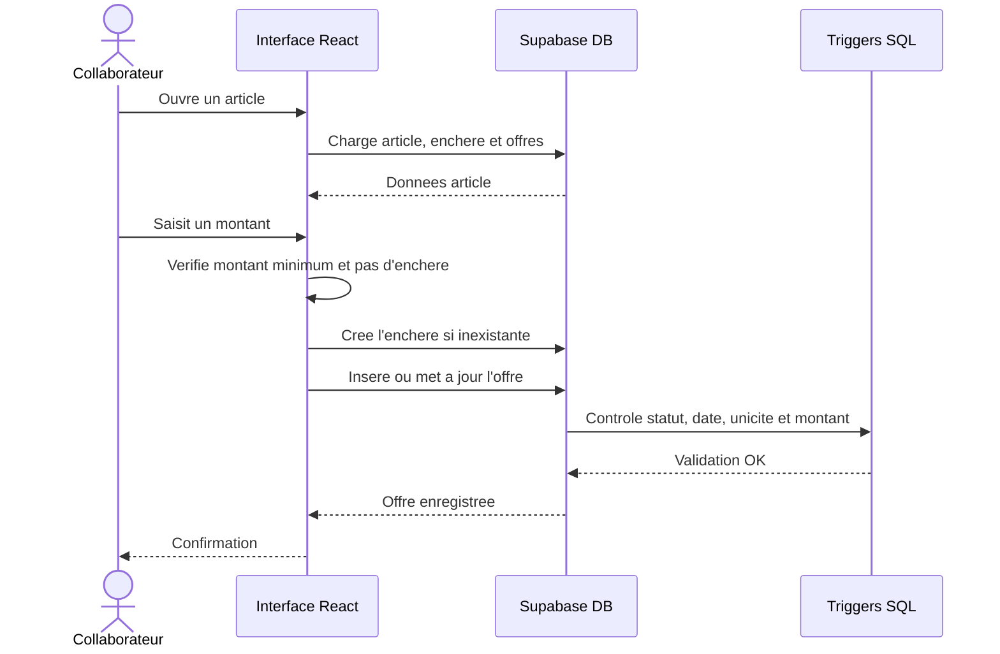
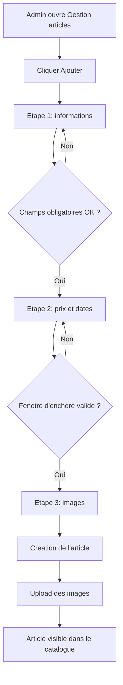
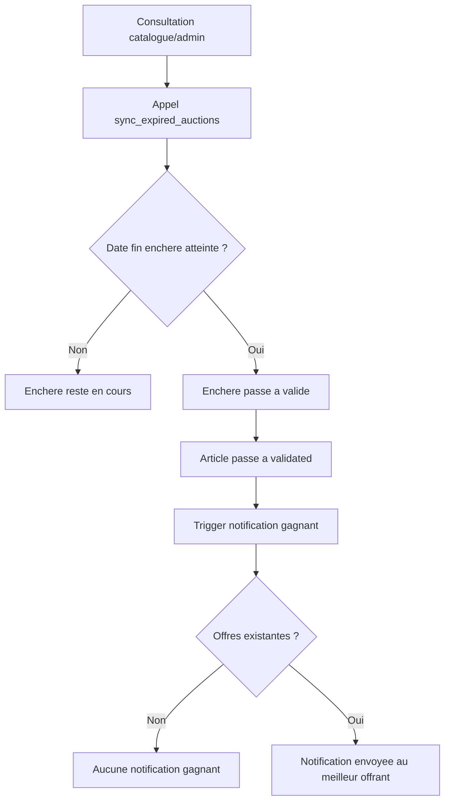
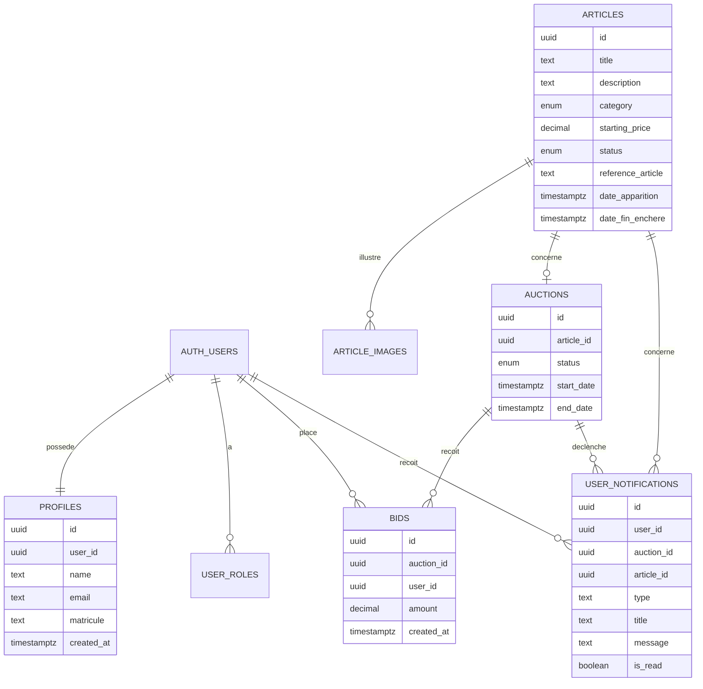

# Cahier des charges et diagrammes de fonctionnement

Projet : SICMA Enchere / Bouygues Encheres  
Date d'analyse : 11/05/2026  
Base analysee : application React/Vite + Supabase presente dans le depot

## 1. Resume du projet

L'application est une plateforme web interne permettant a des collaborateurs de consulter des articles mis en vente, de placer des encheres, de suivre leurs offres et de recevoir une notification lorsqu'ils gagnent une enchere.

Un espace administrateur permet de gerer les utilisateurs, les articles, les images, les periodes d'enchere, le suivi des offres, la validation finale et la generation d'un rapport PDF pour l'enchere remportee.

## 2. Objectifs

- Centraliser la mise aux encheres d'articles internes.
- Permettre aux collaborateurs de s'inscrire avec un matricule au format `SCA0000`.
- Garantir un controle des offres : montant minimum, pas d'enchere, une seule offre par utilisateur et par enchere.
- Automatiser la cloture des encheres arrivees a echeance.
- Identifier le gagnant et lui envoyer une notification.
- Fournir aux administrateurs un tableau de bord et un rapport PDF de resultat.

## 3. Acteurs

| Acteur | Role | Droits principaux |
| --- | --- | --- |
| Collaborateur | Utilisateur standard | Connexion, consultation des articles, placement/modification/annulation de son enchere, consultation de ses messages |
| Administrateur | Gestionnaire de la plateforme | Gestion des articles, utilisateurs, encheres, validation, consultation des statistiques, generation PDF |
| Supabase | Backend applicatif | Authentification, base de donnees, stockage images, securite RLS, fonctions SQL |

## 4. Perimetre fonctionnel

### 4.1 Authentification

- Connexion par email ou par matricule.
- Inscription collaborateur avec :
  - nom complet ;
  - matricule obligatoire au format `SCA` suivi de 4 chiffres ;
  - mot de passe minimum 6 caracteres.
- Generation d'un email technique a partir du matricule : exemple `sca0001@sicma.com`.
- Verification de l'unicite du matricule.
- Attribution automatique du role `user` a la creation du compte.
- Acces admin conditionne au role `admin`.

### 4.2 Catalogue des articles

- Affichage des articles sous forme de cartes.
- Recherche par titre.
- Filtrage par categorie :
  - vehicule ;
  - electronique ;
  - mobilier.
- Affichage de l'image principale, du prix de depart, du statut et du temps restant.
- Les articles clotures restent visibles mais sont marques comme indisponibles.

### 4.3 Detail article et enchere

- Consultation des informations detaillees :
  - titre ;
  - description ;
  - categorie ;
  - prix de depart ;
  - images ;
  - date de fin ;
  - historique des offres.
- Creation automatique d'une enchere si l'article n'en possede pas encore au moment de la premiere offre.
- Placement ou modification d'une offre par l'utilisateur.
- Un utilisateur ne peut avoir qu'une seule offre par enchere.
- Le montant doit respecter un pas selon le prix de depart :

| Prix de depart | Pas minimum |
| --- | --- |
| Moins de 100 000 FCFA | 1 000 FCFA |
| De 100 000 a 999 999 FCFA | 10 000 FCFA |
| 1 000 000 FCFA et plus | 100 000 FCFA |

- Le montant minimum est calcule a partir du prix de depart et de la meilleure offre existante.
- Une enchere expiree ou validee ne peut plus recevoir d'offre.

### 4.4 Mes encheres

- Liste des encheres de l'utilisateur connecte.
- Affichage de l'article, du statut, du montant propose et de la date d'offre.
- Modification d'une offre tant que l'enchere est en cours.
- Annulation d'une offre tant que l'enchere est en cours.
- Boite de messages pour les notifications de victoire.
- Possibilite de marquer un message comme lu.

### 4.5 Administration des articles

- Liste paginee et recherchable des articles.
- Creation et modification via un formulaire en 3 etapes :
  - informations : titre, reference, categorie, description ;
  - tarification : prix de depart, date de parution, date de fin ;
  - images : ajout jusqu'a 5 images.
- Controle de la fenetre d'enchere :
  - date de fin apres la date de parution ;
  - duree maximale de 10 jours.
- Controle d'unicite de la reference article.
- Suppression d'un article.
- Stockage des images dans le bucket Supabase `article-images`.

### 4.6 Administration des encheres

- Liste paginee et recherchable des encheres.
- Affichage :
  - article ;
  - statut ;
  - nombre d'offres ;
  - meilleure offre ;
  - date de debut.
- Consultation du detail d'une enchere.
- Validation manuelle d'une enchere.
- Cloture automatique lorsque la date de fin prevue est atteinte.
- Generation d'un PDF uniquement pour une enchere validee avec un gagnant.

### 4.7 Tableau de bord administrateur

- Statistiques globales :
  - nombre d'utilisateurs ;
  - nombre d'articles ;
  - nombre d'encheres ;
  - encheres en cours ;
  - encheres validees.
- Tableau des 3 meilleures offres par article.

## 5. Regles metier

| Regle | Description |
| --- | --- |
| RB01 | Seuls les utilisateurs authentifies peuvent acceder a l'application. |
| RB02 | L'espace admin est reserve aux utilisateurs ayant le role `admin`. |
| RB03 | Le matricule collaborateur doit respecter le format `SCA0000`. |
| RB04 | Un matricule ne peut etre associe qu'a un seul profil. |
| RB05 | Un article valide/cloture ne peut plus recevoir d'offre. |
| RB06 | Une seule offre est autorisee par utilisateur et par enchere. |
| RB07 | Une offre peut etre modifiee tant que l'enchere est ouverte. |
| RB08 | Le montant d'une offre doit respecter le montant minimum et le pas d'enchere. |
| RB09 | Une enchere arrivee a sa date limite passe au statut `valide`. |
| RB10 | L'article associe a une enchere validee passe au statut `validated`. |
| RB11 | Le gagnant est l'utilisateur ayant la meilleure offre. En cas d'egalite technique, l'offre la plus ancienne est privilegiee dans la notification SQL. |
| RB12 | Une notification est creee pour le gagnant lorsqu'une enchere passe au statut valide. |
| RB13 | Le rapport PDF ne peut etre genere que si l'enchere est validee et contient au moins une offre. |

## 6. Exigences non fonctionnelles

- Application responsive desktop/mobile.
- Interface simple et orientee metier.
- Securite par authentification Supabase et politiques RLS.
- Separation des droits utilisateur/admin.
- Validation cote interface et cote base de donnees.
- Performance amelioree par React Query et chargement lazy des pages.
- Images stockees hors base de donnees, via Supabase Storage.
- Export PDF disponible cote navigateur.

## 7. Architecture applicative

## 8. Diagramme de navigation

## 9. Workflow utilisateur : placer une enchere

## 10. Workflow admin : creation d'un article

## 11. Workflow de cloture d'une enchere

## 12. Modele de donnees simplifie

## 13. Statuts principaux

### Articles

| Statut technique | Libelle | Signification |
| --- | --- | --- |
| `available` | Disponible | Article publie, aucune enchere active encore declenchee |
| `auction_started` | Enchere en cours | Au moins une offre a ete placee |
| `validated` | Valide | Enchere terminee, article indisponible |

### Encheres

| Statut technique | Libelle | Signification |
| --- | --- | --- |
| `en_cours` | En cours | L'enchere accepte les offres |
| `valide` | Validee | L'enchere est cloturee |

## 14. Technologies utilisees

| Couche | Technologie |
| --- | --- |
| Frontend | React 18, TypeScript, Vite |
| UI | Tailwind CSS, shadcn-ui, Radix UI, lucide-react |
| Routage | React Router |
| Donnees client | TanStack React Query |
| Backend | Supabase Auth, PostgreSQL, Storage, RPC |
| PDF | jsPDF, jsPDF AutoTable |
| Tests | Vitest |

## 15. Points forts du projet

- Double validation des encheres : interface et base de donnees.
- Securisation par roles et politiques RLS.
- Parcours admin complet pour piloter les articles et les encheres.
- Cloture automatique via fonction SQL `sync_expired_auctions`.
- Notification automatique du gagnant via trigger SQL.
- Rapport PDF formalise pour l'enchere remportee.
- Application deja structuree avec routes protegees et composants reutilisables.

## 16. Points d'attention releves

- Le fichier de types Supabase ne semble pas totalement synchronise avec les migrations recentes : certaines colonnes comme `reference_article`, `date_apparition`, `date_fin_enchere` et la table `user_notifications` sont utilisees par le code mais absentes du type genere.
- La validation manuelle admin met a jour l'enchere et l'article depuis le frontend ; une fonction SQL dediee pourrait centraliser cette operation.
- La suppression d'article est directe, sans boite de confirmation visible dans le code.
- Certains textes PDF contiennent des caracteres mal encodes dans le code source, par exemple `proposée`.
- Le README est encore generique et ne decrit pas vraiment le projet metier.

## 17. Proposition de plan de presentation

1. Contexte et objectif : pourquoi une plateforme d'encheres interne.
2. Acteurs : collaborateur, administrateur, backend Supabase.
3. Parcours collaborateur : inscription, catalogue, enchere, suivi, notification.
4. Parcours administrateur : articles, encheres, validation, PDF.
5. Regles metier : montant, pas, duree, unicite, cloture.
6. Architecture technique : React, Supabase, Storage, PDF.
7. Modele de donnees : articles, encheres, offres, utilisateurs, notifications.
8. Demonstration ou captures d'ecran.
9. Points forts et securite.
10. Evolutions possibles.

## 18. Evolutions possibles

- Ajouter une confirmation avant suppression d'un article ou d'une offre.
- Ajouter un journal d'audit admin.
- Ajouter des emails automatiques en plus des notifications internes.
- Ajouter une page publique de resultat d'enchere.
- Exporter la liste des encheres en CSV.
- Ajouter des tests automatises sur les regles critiques d'enchere.
- Regenerer les types Supabase pour aligner TypeScript et base de donnees.
